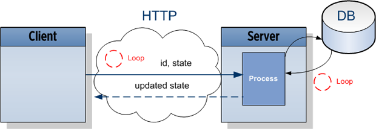
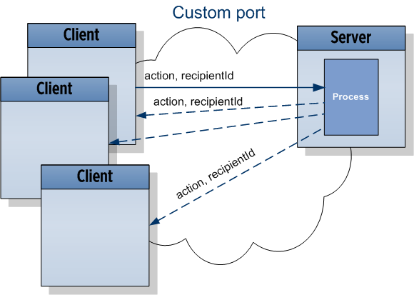
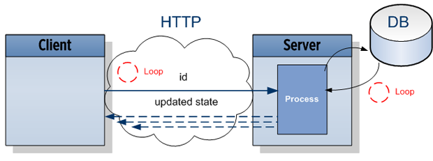

# 为什么HTML5中的Server-sent Event没有被广泛使用
## 一、什么是Server-sent Event
Server-sent Event 最开始是Opera提出的，后被为w3c加入了HTML5标准。用于服务器向浏览器推送消息。
如何
## 二、相似的技术对比
与Server-sent Event类似的技术还有：
- polling 客户端轮训
- Long polling 客户端长轮训
- Web Socket 直接建立Socket连接

polling 客户端每隔*一定时间*向服务器请求数据，服务器查询数据后无论是否有数据，直接返回给客户端。
这种方法的关键在于客户端请求的间隔时间，时间短则没有效率，时间长则实时性不高。缺点是会发送很多无用的请求，造成性能浪费。

Long polling 与polling不同的在于服务器在查询数据后若无数据则不返回给客户端，而是等待一定时间再次查询，直到有数据返回。
在实际应用中还会有一个超时时间，比如30s，在超时时间过后没有数据也返回，然后客户端再次发起连接。
这种方法关键在于服务器端查询的间隔时间和消息的密集度。对于服务器端的间隔时间与polling相同在实际应用中可以使用消息队列或其他可以阻塞程序的操作来进行。
这种方式相对于polling的优点是减少了网络带宽的浪费，缺点是如果消息密度较大则与polling相同。

Web Socket 是在客户端与服务器端建立了真正的双向连接，优点是建立连接后实时性高，而且无消息时基本没有资源浪费。缺点是与polling和long polliing相比改动较大，需要代理服务器支持。

Server sent-Event 像是long polling的升级版，在客户端发起请求后，服务端不断开连接，而是在有消息是向客户端不断写入消息。Server-sent Event有客户端的支持: EventSource。

这种方式看起来是非常好的，但Web QQ、微博等都没有使用此种方式。猜想这其中应该有两方面的原因：
1. 需要代理服务器支持，代理服务器也许会缓存所有的响应，在响应结束后才会发到客户端，这样Server-sent Event就无法工作。
2. 扩展能力没有long polling有优势。
## 三、使用方法
参考以下链接：
> HTML5 服务器推送事件（Server-sent Events）实战开发: <http://www.ibm.com/developerworks/cn/web/1307_chengfu_serversentevent/>
> SSE: 服务器发送事件: <http://javascript.ruanyifeng.com/htmlapi/eventsource.html>
## 四、结论
Server-sent Event作为HTML5的标准，有客户端的支持，有着较快的开发效率、较高实时性，应当是服务器向客户端推送的完美解决方案。以上的种种原因，它并没有被广泛应用。

参考链接：
> WebSockets vs Server-Sent Events vs Long-polling: <http://dsheiko.com/weblog/websockets-vs-sse-vs-long-polling/>
> SSE: 服务器发送事件: <http://javascript.ruanyifeng.com/htmlapi/eventsource.html>